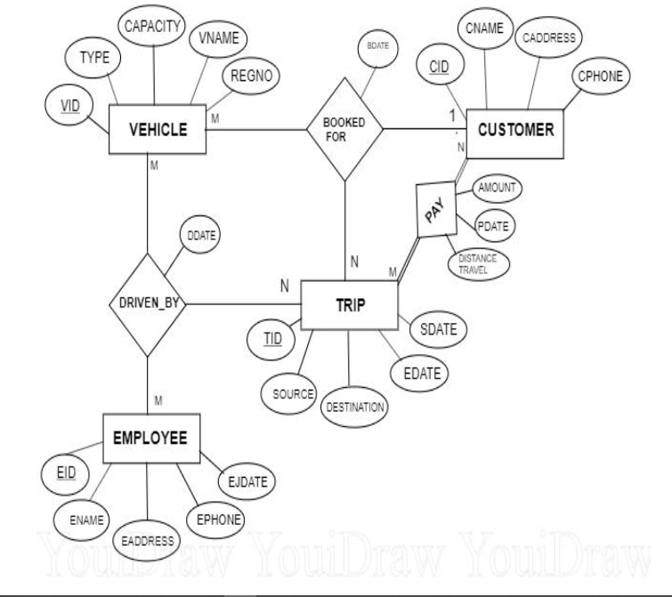
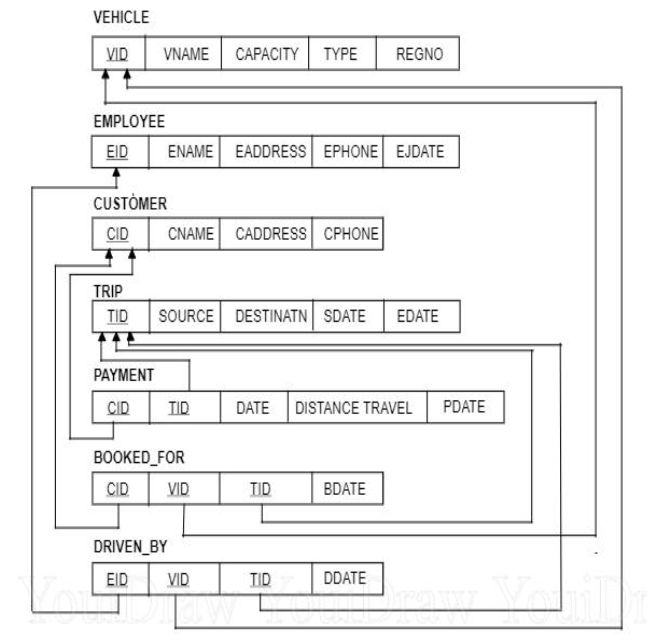
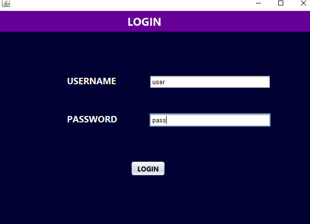
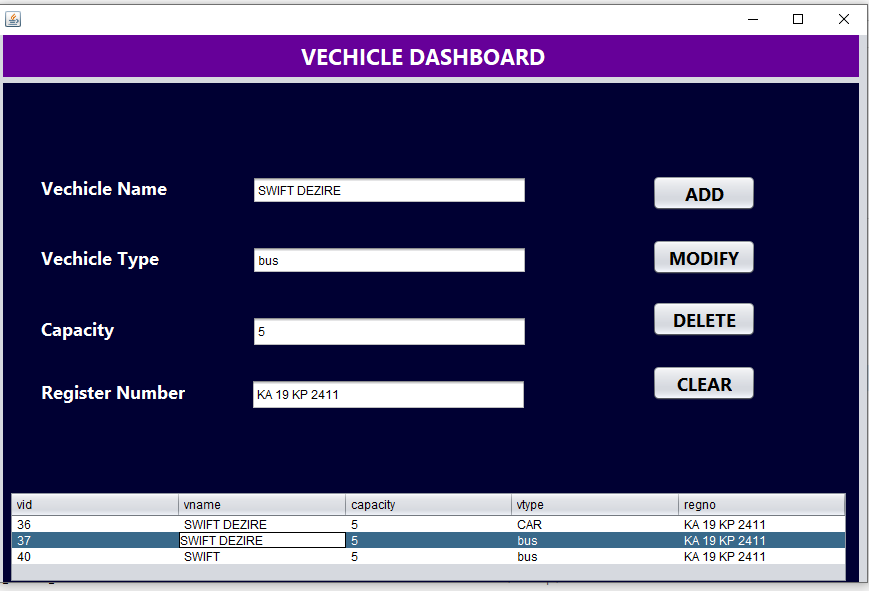
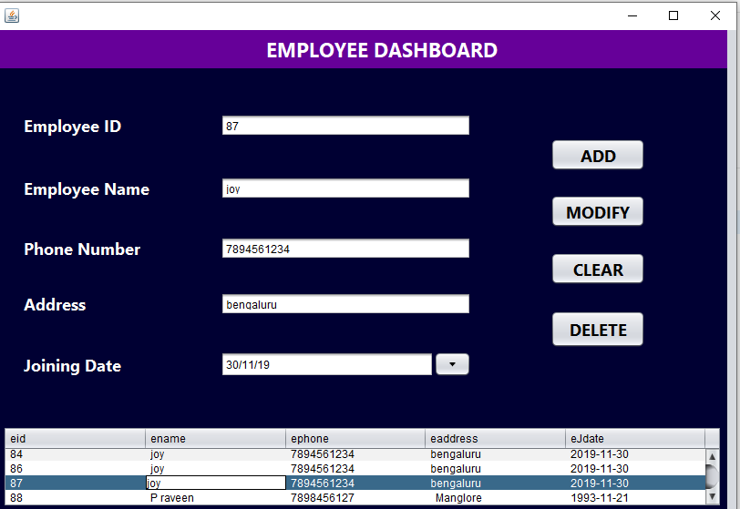
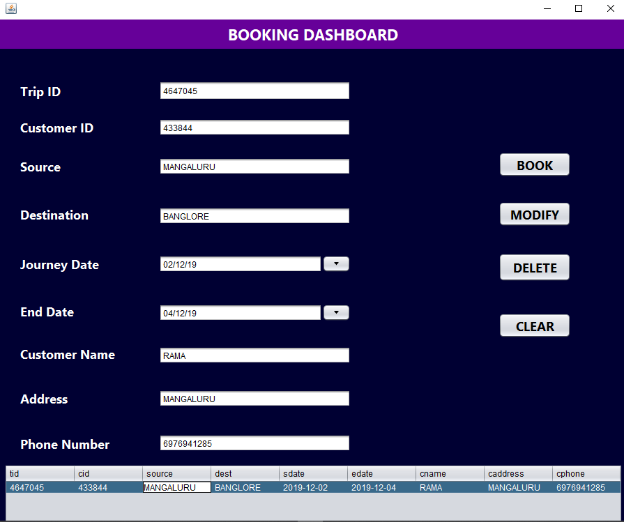
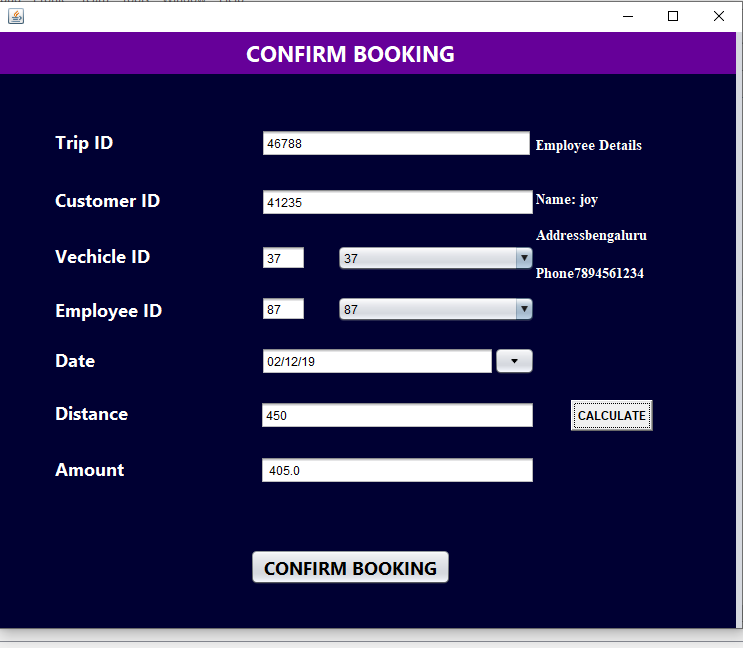

# **SmartTravel 🗺️: Your Intelligent Assistant for Travel Management**

Welcome to SmartTravel -- the next-generation solution equipping travel agencies with the power to organize and harmonize. SmartTravel is a holistic software suite that assists in managing all elements of a travel agency, including vehicle allocation, employee scheduling, trip details, and client bookings.

## **Purpose of SmartTravel**

Everybody needs a well-deserved break! As the world turns to tourism for rejuvenation and adventure, the travel industry bustles with intriguing challenges. SmartTravel steps in to untangle this intricacy. Our mission is to smooth the path for every travel agency to manage their customers and itineraries effectively, thereby curating flawless journeys for each traveller.

## **Features & Benefits**

In a world where time equals money, SmartTravel swoops in to save both for your agency:

- **Administrator Interface**: A user-friendly interface with streamlined workflows, designed from the ground up for system administrators, aims to transform the way they handle data in their travel agency. Our intuitive dashboard provides a bird's eye view of the status of vehicles, trips, and bookings.

- **Efficiency Booster**: SmartTravel diminishes the time spent on manual data recording. By replacing old-school, time-consuming data entry with seamless automation, travel agencies can now devote more time to customer service and other productive tasks.

## **Technology Behind SmartTravel**

Our solution harnesses the power of state-of-the-art technologies for robust and reliable performance:

- **Netbeans**: An integrated development environment (IDE) for developing top-notch applications.
- **MySQL**: A leading open-source relational database management system for secure and efficient data handling.
- **Java**: Used to build high-performing and scalable backend systems.

## **Understanding SmartTravel: ER and Schema Diagrams**

To delve into the nuts and bolts of SmartTravel, check out our Entity Relationship (ER) and Schema Diagrams:

### **Entity Relationship Diagram (ER Diagram)**

Here, we illustrate the logical structure of the database used in SmartTravel.

### **Schema Diagram**

For understanding the physical aspects of our database, here is the schema diagram.

## **Explore SmartTravel: Screenshots**

We're thrilled to give you a sneak peek at SmartTravel's interface. Check out the screenshots of some key sections of our application:

**Admin Login Page**

**Vehicle Dashboard Page**

**Employee Dashboard Page**

**Booking Dashboard Page**

**Confirmation Booking Page**

